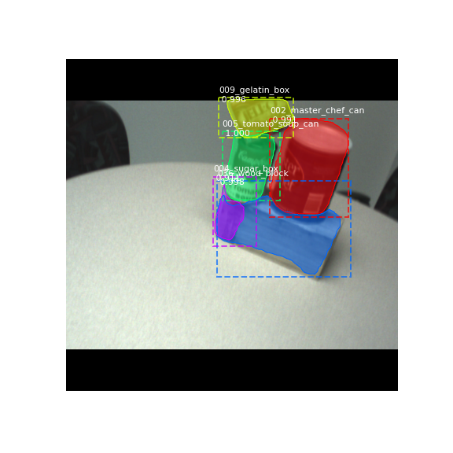

Mask R-CNN trained on YCB Video Dataset
====

Detection example (trained for 8 epochs):


Setup
----

1. Install Packages
    1. conda environment
        There are two conda environments.
        One for inference on gpu, one for inference the cpu.
        The different environments are needed, 
        as there are separate tensorflow packages for cpu/gpu.

        - For CPU inference install the `mask_rcnn_cpu` environment:
            ```bash
            conda env create -f environment_cpu.yml
            ```
        - For GPU inference install the `mask_rcnn_gpu` environment:
            ```bash
            conda env create -f environment_gpu.yml
            ```
    
    2. Manual installation
        The conda environments are the easiest way to get all packages with the required versions.
        Nevertheless, one can install major packages on their own.
        The most important packages with the correct versions are the following:
        - python 3.6
        - tensorflow 1.15.0 or tensorflow-gpu 1.15.0
        - keras 2.3.1
        - scikit-image 0.16.2
        - h5py 2.10.0
        Make sure to install exactly these versions, as different versions will not work in many cases.
        Lookup the [environment_cpu.yml](environment_cpu.yml) or [environment_gpu.yml](environment_gpu.yml)
        for further, required packages that need to be installed.

1. Acivate conda environment

    - For CPU inference
        ```bash
        conda activate mask_rcnn_cpu
        ```
    - For GPU inference
        ```bash
        conda activate mask_rcnn_gpu
        ```

Training

1. Download YCB Video Dataset

    The YCB Video Dataset can be downloaded from [https://rse-lab.cs.washington.edu/projects/posecnn/](https://rse-lab.cs.washington.edu/projects/posecnn/).
    The whole dataset is stored on google drive as ZIP file and has approximatly 265 GB of size.

    Unzip the downloaded dataset and copy or symlink it to `samples/ycb/data/YCB_Video_Dataset`

1. Generate Coco-Like Annotations

    Activate the conda environment.
    To train the MaskRCNN, it is the easiest to convert the YCB Video Dataset annotations
    to the format that was also used in the COCO dataset.
    Therefore execute the [video_data_annotations_generator.py](samples/ycb/video_data_annotations_generator.py).
    This script can take more than an hour.
    Set the number of threads to use with `--jobs=%NUM_JOBS%`.

1. Train MaskRCNN

    Activate the conda environment.
    The MaskRCNN can be trained by executing
    ```commandline
        export KERAS_BACKEND=tensorflow
        python samples/ycb/train_ycb.py
    ```
    Per default, a snapshot of the model will be made every epoch.
    They can be found in the [logs](samples/ycb/logs) folder.